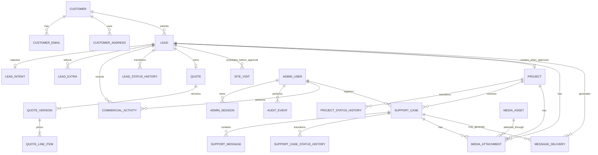

# SOLIMA Backend — Conceptual Domain Model and DER

Status: draft for iterative business approval  
Infrastructure target: Railway initially, portable to physical Linux servers  
Database target: PostgreSQL  
Tenancy: single organization — SOLIMA

## 1. Modeling principles

This is a conceptual business model. It deliberately precedes Prisma field types, SQL tables and migrations.

Rules:

- Customer identity is distinct from a lead submission.
- Commercial state is distinct from WhatsApp delivery state.
- A project is created from an approved lead, not used as an alias for the lead.
- Support is an operational case, not a commercial lead.
- Internal notes are distinct from customer-facing communication.
- Audit events preserve who changed what and when.
- Media belongs to an explicit business record.
- History is preserved instead of overwriting material business events.

## 2. Approved domain decisions

### Customer recognition

The primary normalized telephone number is the operational customer identity.

- Input is normalized to E.164.
- A public submission stores a contact snapshot on Lead and does not create Customer.
- When a Lead is approved, its normalized phone resolves the existing Customer or creates one.
- Each Customer has exactly one active telephone.
- Display formatting is presentation-only.
- The normalized phone must be unique among active customer records.
- Telephone reassignment, customer merging and anonymization require audited administrative operations.
- A telephone must never be silently transferred between customers.

### Public lead media requirement

Every public Lead submission must include between one and five work-location photographs, regardless of selected service.

- server validation is authoritative
- browser validation mirrors the rule for usability
- inspiration photographs remain optional, from zero to two
- a missing location photograph rejects the submission before business persistence
- all existing media signature, size, pixel, decode, re-encode, metadata-removal and cleanup controls remain mandatory
- rollout is a versioned public-contract change and requires frontend/API compatibility testing

### Commercial approval prerequisite

A Lead can transition to `APPROVED` only when it has an accepted QuoteVersion.

- acceptance is recorded explicitly with timestamp and administrator attribution
- a draft or merely sent quote does not authorize approval
- approval remains a separate authenticated administrator command
- accepting a quote never creates Customer or Project silently
- the accepted version becomes immutable commercial evidence

### Lead-to-project conversion

After a QuoteVersion is accepted, when an administrator changes the Lead to `APPROVED`, the system creates the associated Project in the same business operation.

The operation must be:

- transactional
- idempotent
- authorized
- audited
- protected by a unique lead-to-project relationship

Repeating the command must return the existing Project instead of creating another.

### Support intake

Support and complaints are initially registered only by the administrator inside SOLIMA Office and must reference an existing Project.

Consequences:

- no public support submission endpoint in the first release
- no anonymous ticket intake
- no support case without a SOLIMA Project
- Customer ownership is derived through Project to avoid contradictory duplicate ownership
- every case records the administrator who registered it
- the source of the report must be recorded
- public support UI remains disabled
- a future customer portal can be added without changing the core SupportCase model

## 3. Bounded contexts

### Identity and Access

- AdminUser
- AdminSession
- PasswordCredential
- LoginAttempt
- AccountRecovery
- AuditEvent

### Customer and Contact

- Customer
- CustomerEmail
- CustomerAddress

### Commercial

- Lead
- LeadIntent
- LeadExtra
- CommercialActivity
- LeadStatusHistory
- Quote
- QuoteVersion
- QuoteLineItem
- Project
- ProjectStatusHistory
- SiteVisit

### Support

- SupportCase
- SupportCaseCategory
- SupportCaseStatusHistory
- SupportMessage
- SupportAssignment

### Media

- MediaAsset
- MediaAttachment

### Messaging and Operations

- MessageDelivery
- ProviderWebhookEvent
- Notification
- OperationalSetting

## 4. Core conceptual DER



## 5. Aggregate boundaries

### Customer aggregate

Customer is created only when a Lead is approved. Before approval, contact data remains an immutable business snapshot on Lead.

Invariant:

- one active telephone per Customer
- one active Customer per normalized telephone
- Customer creation happens inside the approval transaction
- an existing Customer with the Lead phone is reused
- contact changes are audited
- prior Lead contact snapshots are not rewritten when Customer contact changes

### Lead aggregate

Lead represents one commercial opportunity or request.

It owns:

- original submitted information
- captured intent
- selected extras
- lead media references
- commercial state history
- commercial activities
- site visits before project approval
- quotes and their immutable versions

A Customer can submit multiple Leads. Repeated contact does not overwrite prior opportunities.

### Quote aggregate

Quote represents the commercial proposal process for one Lead. QuoteVersion preserves every material proposal revision.

Approved invariants:

- a Lead has at most one Quote
- a Quote has one or more ordered QuoteVersions
- a materially different commercial opportunity requires a new Lead
- only an accepted QuoteVersion permits Lead approval
- only one QuoteVersion is current at a time
- a sent version is immutable; corrections create a new version
- acceptance applies to a specific QuoteVersion
- acceptance and Lead approval are separate audited administrator actions
- SiteVisit belongs to Lead because it occurs before Project creation
- a Lead may have multiple SiteVisits

Approved QuoteVersion lifecycle:

```text
DRAFT -> ISSUED -> ACCEPTED
                 |-> SUPERSEDED
                 |-> DECLINED
                 \-> EXPIRED

DRAFT -> VOIDED
```

Transition rules:

- DRAFT is editable and has not been formally issued
- ISSUED is immutable commercial evidence
- issuing a new version marks the previously issued current version SUPERSEDED in the same transaction
- only ISSUED may transition to ACCEPTED, DECLINED or EXPIRED
- only DRAFT may transition to VOIDED
- ACCEPTED, SUPERSEDED, DECLINED, EXPIRED and VOIDED are terminal
- at most one version per Quote may be current
- at most one version per Quote may be ACCEPTED
- acceptance records administrator, timestamp and evidence source
- Quote overall status is derived from its current or accepted version instead of duplicated independently

Approved financial structure:

- every QuoteVersion contains structured QuoteLineItems
- line items preserve description, classification, quantity, unit, unit price and ordering
- subtotal, adjustments, tax and total are calculated from version-owned values
- monetary values use exact decimal arithmetic, never binary floating point
- an issued version snapshots every financial value and calculation input
- changing scope, price, discount or tax after issue requires a new QuoteVersion
- a free-text-only total is not an acceptable canonical commercial record

Approved currency policy:

- customer-facing quotes use only Mozambican metical
- every QuoteVersion persists the ISO 4217 code `MZN` explicitly
- monetary values use two decimal places and deterministic rounding
- database and application calculations use exact decimal types, never `float` or binary floating point
- all QuoteLineItems in one QuoteVersion share the version currency
- multi-currency quoting is not enabled in the initial system

Approved tax policy:

- tax configuration is versioned and centrally managed
- each QuoteVersion snapshots the tax label, rate, mode and calculated amount used at issue time
- changing the active tax configuration never recalculates issued historical versions
- the quote document states explicitly whether displayed prices exclude or include tax
- zero-rated, exempt or non-applicable treatment requires an explicit reason
- the production default rate remains disabled or unconfirmed until SOLIMA accounting validates its fiscal treatment
- tax is calculated using exact decimals and the approved deterministic rounding rule
- canonical calculation order is: line subtotal, approved discount, taxable base, tax amount, final total
- all calculated components are persisted on an issued QuoteVersion for audit and independently recomputed during validation

Approved discount policy:

- a QuoteVersion may have at most one global discount
- discount kind is either `PERCENTAGE` or `FIXED_MZN`, never both
- a discount requires a bounded reason
- percentage must be between zero and one hundred
- fixed discount must be non-negative and cannot exceed the line subtotal
- the calculated discount amount is persisted and independently recomputed during issue validation
- the administrator and timestamp are audited
- an issued discount is immutable; changing it requires a new QuoteVersion
- line-level discounts are not enabled in the initial system
- future staff roles may introduce approval thresholds without changing the commercial model

Approved QuoteVersion validity policy:

- the configurable default validity period is thirty calendar days
- every issued version snapshots `issuedAt` and `validUntil`
- an authorized administrator may choose another permitted period before issue
- changing the system default never alters issued versions
- an ISSUED version becomes EXPIRED after `validUntil` when it has not reached another terminal state
- an expired version cannot be accepted, edited or reactivated
- continuing negotiation after expiry requires a new QuoteVersion
- acceptance and expiry use one atomic conditional transition so only one can win under concurrency
- expiry processing is idempotent and does not depend exclusively on an in-memory timer

Approved QuoteVersion acceptance evidence policy:

- only an authenticated authorized administrator records acceptance initially
- acceptance channel is required and one of `SIGNED_DOCUMENT`, `WHATSAPP`, `EMAIL`, `IN_PERSON` or `OTHER`
- the accepted QuoteVersion, acceptance timestamp, confirming person's name and recording administrator are required
- acceptance requires at least one verifiable evidence reference, bounded evidence note or authorized private attachment
- `OTHER` requires an explicit bounded explanation
- evidence attachments use the private authenticated attachment lifecycle, not public lead transport media
- acceptance evidence is immutable; corrections append an audited event rather than rewriting history
- accepting a version appends commercial history and audit records atomically
- without valid evidence the version cannot transition to ACCEPTED
- acceptance does not itself create Customer or Project; the separate Lead approval command remains required

Approved SiteVisit requirement:

- `NEW_CONSTRUCTION` requires at least one completed SiteVisit before the first QuoteVersion can be ISSUED
- `MODERNIZATION` requires at least one completed SiteVisit before the first QuoteVersion can be ISSUED
- `MAINTENANCE` may be quoted without a SiteVisit after the administrator records a remote-assessment decision based on the mandatory location photographs and available diagnostic information
- a SiteVisit is never inferred from photographs; it is a separate scheduled and completed business record
- issuing a version validates the service-specific prerequisite transactionally
- changing the selected primary service re-evaluates the prerequisite
- a waiver is not available for NEW_CONSTRUCTION or MODERNIZATION in the initial system
- the QuoteVersion snapshots the completed SiteVisit or remote-assessment basis used for issue

Approved SiteVisit lifecycle:

```text
SCHEDULED -> COMPLETED
          |-> CANCELLED
          |-> NO_SHOW
          \-> RESCHEDULED -> new SCHEDULED SiteVisit
```

Transition rules:

- a SCHEDULED visit has a bounded time interval, address snapshot and responsible administrator or staff member
- COMPLETED requires completion time, technical report and recorded outcome
- CANCELLED requires actor, reason and cancellation time
- NO_SHOW records whether the customer was absent or site access was unavailable
- RESCHEDULED is terminal and atomically creates a new SCHEDULED visit linked through `rescheduledFromId`
- terminal visits are never reopened or silently edited
- a Lead may own multiple visits
- scheduling changes append history and preserve prior intervals
- future staff scheduling must prevent conflicting assignments through transactional overlap checks

Approved SiteVisit technical report:

A SiteVisit may transition to COMPLETED only when its report records:

- actual arrival and departure timestamps
- participants
- relevant measurements and dimensions
- terrain conditions or existing-structure condition
- site access constraints
- water, electricity and drainage availability
- existing equipment when applicable
- technical and safety risks
- identified needs
- recommendations
- at least one authorized private technical photograph
- optional bounded additional observations
- exactly one conclusion: `FEASIBLE`, `FEASIBLE_WITH_CONDITIONS`, `NEEDS_FURTHER_ASSESSMENT` or `NOT_FEASIBLE`

Report rules:

- structured fields are canonical; narrative notes supplement them
- private photographs use authenticated attachment storage and audited access
- COMPLETED records the author and completion timestamp
- material correction creates a versioned amendment and audit event
- `NEEDS_FURTHER_ASSESSMENT` does not satisfy the visit prerequisite for issuing a QuoteVersion
- `NOT_FEASIBLE` blocks quote issue unless a later completed visit reaches an eligible conclusion
- exact eligible conclusions for quote issue are `FEASIBLE` and `FEASIBLE_WITH_CONDITIONS`

Lead commercial lifecycle is approved in the state-separation section below.

### Project aggregate

Project is operational work accepted by SOLIMA.

Approved compact lifecycle:

```text
PLANNED -> IN_PROGRESS -> COMPLETED -> ARCHIVED
             |    ^
             v    |
           PAUSED

PLANNED/IN_PROGRESS -> CANCELLED -> ARCHIVED
```

Invariant:

- at most one Project is created from one Lead
- Project creation requires Lead state `APPROVED`
- the transition and Project creation occur atomically
- a paused Project can resume
- completed and cancelled Projects can be archived
- planned dates, actual dates and warranty dates are attributes, not statuses
- every status transition appends history

### SupportCase aggregate

SupportCase represents a support request, incident, complaint or warranty concern.

Approved category policy:

- categories are database records, not PostgreSQL enums
- categories can be added and reordered by an authorized administrator
- a category already in use can be deactivated but not deleted
- initial categories: Maintenance, Warranty, Technical Issue, Complaint, Administrative Question and Other
- priority is selected manually by the administrator
- approved priorities: NORMAL, HIGH and URGENT
- every priority has a formal SLA policy
- SLA deadlines and breaches must be computed and auditable

Invariant:

- it is registered by an authenticated administrator
- it must reference a Project
- its Customer is derived from Project
- state changes append history
- internal notes and customer-visible messages are distinguishable
- closure records who closed it and why

### Identity aggregate

AdminUser is the administrative identity. AdminSession represents server-side authenticated access.

Initial release has one `SUPER_ADMIN`, but models do not assume that only one user can ever exist.

### Messaging aggregate

MessageDelivery is a provider-agnostic outbox record. WhatsApp-specific identifiers remain provider metadata instead of defining the domain model.

## 6. State separation

### Lead commercial state

Approved compact lifecycle:

```text
NEW -> CONTACTED -> QUALIFIED -> APPROVED
  |       |            |------> LOST
  |       |            |------> CANCELLED
  |       |            \------> DUPLICATE
  |       |-------------------> LOST/CANCELLED/DUPLICATE
  \---------------------------> LOST/CANCELLED/DUPLICATE
```

Rules:

- NEW means a durable public or authorized internal request was received
- CONTACTED requires a recorded real commercial contact
- QUALIFIED means SOLIMA confirmed that the need can proceed through its commercial process
- APPROVED requires an accepted QuoteVersion and atomically resolves Customer and creates Project
- LOST requires a structured active closure reason and bounded note
- CANCELLED requires actor, structured reason and bounded note
- DUPLICATE requires a canonical Lead reference and cannot point to itself
- terminal Leads are never silently reopened; a genuinely renewed opportunity creates a new Lead linked to the prior one
- SiteVisit and QuoteVersion states produce a derived progress view and are not duplicated as Lead states
- PROJECT_CREATED is not a Lead state; the unique Project relation is authoritative
- every transition appends LeadStatusHistory and AuditEvent

Approved terminal-reason policy:

- closure reasons are database-managed records, not fixed PostgreSQL enums
- reasons have stable code, display label, applicable terminal state, order and active flag
- a reason already used may be deactivated but never deleted
- LOST requires one active LOST reason
- CANCELLED requires one active CANCELLED reason
- OTHER requires a bounded explanation
- DUPLICATE does not use a free-form reason and requires a canonical Lead reference
- reporting groups terminal outcomes by stable reason code

Initial LOST reasons:

- `PRICE`
- `NO_RESPONSE`
- `COMPETITOR`
- `OUT_OF_SCOPE`
- `NOT_FEASIBLE`
- `OUTSIDE_SERVICE_AREA`
- `TIMING`
- `OTHER`

Initial CANCELLED reasons:

- `CUSTOMER_REQUEST`
- `SOLIMA_DECISION`
- `CREATED_IN_ERROR`
- `OTHER`

### Message delivery state

```text
PENDING -> PROCESSING -> RETRY -> ACCEPTED -> SENT -> DELIVERED -> READ
                                \-> FAILED
```

### Support state

Approved state set:

```text
OPEN -> TRIAGED -> IN_PROGRESS -> WAITING_CUSTOMER
                      ^               |
                      |_______________|
IN_PROGRESS -> RESOLVED -> CLOSED
RESOLVED/CLOSED -> REOPENED -> IN_PROGRESS
OPEN/TRIAGED/IN_PROGRESS -> CANCELLED
```

Exact reopen eligibility and SLA clock behavior remain to be approved. Every transition appends status history.

These state machines must be approved before SQL enums or application transition guards are created.

## 7. Customer resolution flow

Proposed submission transaction:

1. Normalize public telephone to E.164.
2. Create Lead with an immutable contact snapshot.
3. Do not create or modify Customer.
4. Create the public-submission graph.
5. Create the durable messaging outbox.
6. Commit atomically.

Idempotency is still evaluated before creating duplicate business records.

## 8. Approval conversion flow

Proposed administrator command:

1. Authenticate session.
2. Authorize `lead.approve`.
3. Load Lead and existing Project relation.
4. If Project exists, return it.
5. Validate that a specific QuoteVersion is accepted.
6. Validate allowed current Lead state.
7. Append LeadStatusHistory.
8. Resolve Customer by the Lead normalized phone.
9. Create Customer if no active Customer exists for that phone.
10. Attach Lead to Customer without changing the original Lead snapshot.
11. Set Lead to `APPROVED`.
12. Create Project with unique `sourceLeadId`, accepted QuoteVersion and resolved Customer.
13. Append initial ProjectStatusHistory.
14. Write AuditEvent.
15. Commit one transaction.

## 9. Support registration flow

Proposed administrator command:

1. Select an existing Project.
2. Derive Customer from Project.
3. Select case type/category.
4. Record report source and description.
5. Attach safe media if provided.
6. Generate unique human-readable protocol.
7. Create initial status history.
8. Write AuditEvent.
9. Commit.
10. Notify according to approved operational policy.

## 10. Open conceptual decisions

- support business calendar and timezone
- formal response, mitigation and resolution targets
- SLA pause behavior in WAITING_CUSTOMER
- reopen eligibility and SLA clock-reset behavior
- commercial transition permissions
- project lifecycle
- appointment ownership
- customer-visible versus internal communication
- retention and anonymization rules
- notification recipients and escalation
