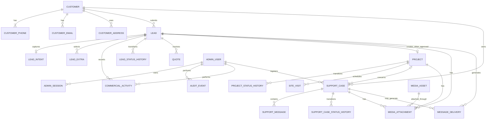

# SOLIMA Backend — Conceptual Domain Model and DER

Status: draft for iterative business approval  
Infrastructure target: Railway initially, portable to physical Linux servers  
Database target: PostgreSQL  
Tenancy: single organization — SOLIMA

## 1. Modeling principles

This is a conceptual business model. It deliberately precedes Prisma field types, SQL tables and migrations.

Rules:

- Customer identity is distinct from a lead submission.
- Commercial state is distinct from WhatsApp delivery state.
- A project is created from an approved lead, not used as an alias for the lead.
- Support is an operational case, not a commercial lead.
- Internal notes are distinct from customer-facing communication.
- Audit events preserve who changed what and when.
- Media belongs to an explicit business record.
- History is preserved instead of overwriting material business events.

## 2. Approved domain decisions

### Customer recognition

The primary normalized telephone number is the operational customer identity.

- Input is normalized to E.164.
- Two submissions with the same normalized primary telephone resolve to the same Customer.
- Display formatting is presentation-only.
- The normalized phone must be unique among active customer records.
- Customer merging, number reassignment and anonymization require audited administrative operations.
- A telephone should not be silently transferred between customers.

### Lead-to-project conversion

When an administrator changes a lead to `APPROVED`, the system creates the associated Project in the same business operation.

The operation must be:

- transactional
- idempotent
- authorized
- audited
- protected by a unique lead-to-project relationship

Repeating the command must return the existing Project instead of creating another.

### Support intake

Support and complaints are initially registered only by the administrator inside SOLIMA Office.

Consequences:

- no public support submission endpoint in the first release
- no anonymous ticket intake
- every case records the administrator who registered it
- the source of the report must be recorded
- public support UI remains disabled
- a future customer portal can be added without changing the core SupportCase model

## 3. Bounded contexts

### Identity and Access

- AdminUser
- AdminSession
- PasswordCredential
- LoginAttempt
- AccountRecovery
- AuditEvent

### Customer and Contact

- Customer
- CustomerPhone
- CustomerEmail
- CustomerAddress

### Commercial

- Lead
- LeadIntent
- LeadExtra
- CommercialActivity
- LeadStatusHistory
- Quote
- QuoteVersion
- Project
- ProjectStatusHistory
- SiteVisit

### Support

- SupportCase
- SupportCaseCategory
- SupportCaseStatusHistory
- SupportMessage
- SupportAssignment

### Media

- MediaAsset
- MediaAttachment

### Messaging and Operations

- MessageDelivery
- ProviderWebhookEvent
- Notification
- OperationalSetting

## 4. Core conceptual DER



## 5. Aggregate boundaries

### Customer aggregate

Customer is the stable business party. Its phone, email and address are contact points, not independent customers.

Invariant:

- one active primary phone per Customer
- one active Customer per normalized primary phone
- contact-point changes are audited

### Lead aggregate

Lead represents one commercial opportunity or request.

It owns:

- original submitted information
- captured intent
- selected extras
- lead media references
- commercial state history
- commercial activities

A Customer can submit multiple Leads. Repeated contact does not overwrite prior opportunities.

### Project aggregate

Project is operational work accepted by SOLIMA.

Invariant:

- at most one Project is created from one Lead
- Project creation requires Lead state `APPROVED`
- the transition and Project creation occur atomically

### SupportCase aggregate

SupportCase represents a support request, incident, complaint or warranty concern.

Invariant:

- it is registered by an authenticated administrator
- it belongs to a Customer
- it may reference a Project
- state changes append history
- internal notes and customer-visible messages are distinguishable
- closure records who closed it and why

### Identity aggregate

AdminUser is the administrative identity. AdminSession represents server-side authenticated access.

Initial release has one `SUPER_ADMIN`, but models do not assume that only one user can ever exist.

### Messaging aggregate

MessageDelivery is a provider-agnostic outbox record. WhatsApp-specific identifiers remain provider metadata instead of defining the domain model.

## 6. State separation

### Lead commercial state

Proposed conceptual lifecycle:

```text
NEW -> CONTACTED -> SITE_VISIT_SCHEDULED -> QUOTE_PREPARING
    -> QUOTE_SENT -> NEGOTIATION -> APPROVED -> PROJECT_CREATED

Terminal alternatives:
LOST
DUPLICATE
CANCELLED
```

### Message delivery state

```text
PENDING -> PROCESSING -> RETRY -> ACCEPTED -> SENT -> DELIVERED -> READ
                                \-> FAILED
```

### Support state

Initial proposal:

```text
OPEN -> TRIAGED -> IN_PROGRESS -> WAITING_CUSTOMER
     -> RESOLVED -> CLOSED

Alternative:
OPEN/IN_PROGRESS -> CANCELLED
```

These state machines must be approved before SQL enums or application transition guards are created.

## 7. Customer resolution flow

Proposed submission transaction:

1. Normalize public telephone to E.164.
2. Find active CustomerPhone by normalized value.
3. If found, attach the new Lead to its Customer.
4. If not found, create Customer and primary CustomerPhone.
5. Create Lead and public-submission graph.
6. Create durable messaging outbox.
7. Commit atomically.

Idempotency is still evaluated before creating duplicate business records.

## 8. Approval conversion flow

Proposed administrator command:

1. Authenticate session.
2. Authorize `lead.approve`.
3. Load Lead and existing Project relation.
4. If Project exists, return it.
5. Validate allowed current Lead state.
6. Append LeadStatusHistory.
7. Set Lead to `APPROVED`.
8. Create Project with unique `sourceLeadId`.
9. Append initial ProjectStatusHistory.
10. Write AuditEvent.
11. Commit one transaction.

## 9. Support registration flow

Proposed administrator command:

1. Resolve Customer by normalized phone.
2. Select optional related Project.
3. Select case type/category.
4. Record report source and description.
5. Attach safe media if provided.
6. Generate unique human-readable protocol.
7. Create initial status history.
8. Write AuditEvent.
9. Commit.
10. Notify according to approved operational policy.

## 10. Open conceptual decisions

- whether public lead submission automatically creates a Customer or creates a provisional identity first
- whether a Customer can have multiple active phone numbers
- whether support can exist without a related Project
- support categories and priorities
- SLA rules
- commercial transition permissions
- project lifecycle
- quote/version lifecycle
- appointment ownership
- customer-visible versus internal communication
- retention and anonymization rules
- notification recipients and escalation
