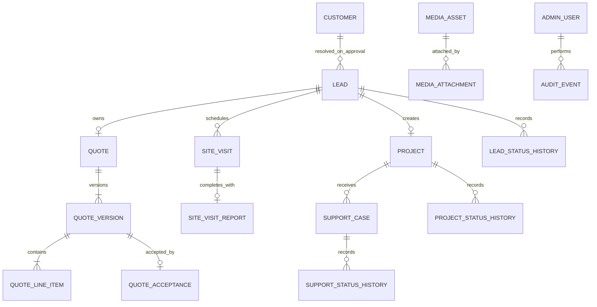

# SOLIMA Backend — PostgreSQL Logical Model

Status: draft for iterative approval  
Source of truth: `BACKEND-CONCEPTUAL-DOMAIN-MODEL.md`  
Database: PostgreSQL  
Deployment: Railway initially; portable to physical Linux servers  
Tenancy: SOLIMA only

## 1. Purpose

This document translates the approved conceptual model into a relational PostgreSQL design. It defines table boundaries, primary and foreign keys, uniqueness, checks, history and transaction constraints before Prisma models or migrations are written.

The following are intentionally still proposals until explicitly approved:

- exact retention periods and anonymization triggers
- exact column lengths and attachment retention
- staff permissions beyond the initial administrator
- final tax default validated by accounting

## 2. Relational conventions

Proposed conventions:

- UUID primary keys use `uuid`
- timestamps use `timestamptz` and are stored as instants
- business dates without a time use `date`
- monetary fields use `numeric(14,2)`
- percentages use `numeric(7,4)`
- normalized telephone uses E.164 text
- public identifiers are immutable text with database uniqueness
- mutable records use `created_at` and `updated_at`
- material transitions append history rather than overwrite evidence
- externally supplied idempotency keys are scoped and uniquely constrained
- business state enums may use PostgreSQL enums only when the approved set is closed; administrator-managed categories and reasons use tables

## 3. Core relationship map



## 4. Identity and administration

### `admin_user`

- `id uuid PK`
- `email citext UNIQUE NOT NULL`
- `display_name text NOT NULL`
- `role admin_role NOT NULL`
- `status admin_status NOT NULL`
- `created_at timestamptz NOT NULL`
- `updated_at timestamptz NOT NULL`

Initial data contains one `SUPER_ADMIN`; the schema does not enforce a single lifetime user.

### `password_credential`

- `admin_user_id uuid PK/FK -> admin_user.id`
- `password_hash text NOT NULL`
- `password_changed_at timestamptz NOT NULL`
- `credential_version integer NOT NULL CHECK (credential_version > 0)`

Passwords are never stored reversibly.

### `admin_session`

- `id uuid PK`
- `admin_user_id uuid FK NOT NULL`
- `token_hash text UNIQUE NOT NULL`
- `expires_at timestamptz NOT NULL`
- `revoked_at timestamptz NULL`
- `last_seen_at timestamptz NULL`
- `created_at timestamptz NOT NULL`

## 5. Customers and leads

### `customer`

- `id uuid PK`
- `public_number text UNIQUE NOT NULL` if customer numbering is later approved
- `name text NOT NULL`
- `phone_e164 text NOT NULL`
- `status customer_status NOT NULL`
- `created_from_lead_id uuid UNIQUE NOT NULL`
- `created_at timestamptz NOT NULL`
- `updated_at timestamptz NOT NULL`

Proposed database invariant for the approved identity rule:

```sql
CREATE UNIQUE INDEX customer_one_active_phone
ON customer (phone_e164)
WHERE status = 'ACTIVE';
```

Inactive and anonymized lifecycle states will preserve the row and its business relationships. The exact retention period and anonymization trigger remain to be approved.

### `lead`

- `id uuid PK`
- `public_number text UNIQUE NOT NULL`
- `customer_id uuid FK NULL` until approval
- immutable contact snapshot: `contact_name`, `phone_input`, `phone_e164`, optional `email`
- service and request snapshot fields
- `status lead_status NOT NULL`
- `closure_reason_id uuid FK NULL`
- `duplicate_of_lead_id uuid FK NULL`
- `renewed_from_lead_id uuid FK NULL`
- `approved_at timestamptz NULL`
- `approved_by_admin_id uuid FK NULL`
- `created_at timestamptz NOT NULL`
- `updated_at timestamptz NOT NULL`

Checks:

- `duplicate_of_lead_id <> id`
- `DUPLICATE` requires `duplicate_of_lead_id`
- `LOST` and `CANCELLED` require an applicable closure reason
- non-terminal states cannot carry a closure reason
- approval requires an accepted QuoteVersion and is enforced in the approval transaction

### `lead_closure_reason`

- `id uuid PK`
- `code text NOT NULL`
- `terminal_status lead_terminal_status NOT NULL`
- `label text NOT NULL`
- `sort_order integer NOT NULL`
- `active boolean NOT NULL DEFAULT true`
- timestamps

Unique: `(terminal_status, code)`. Used reasons are deactivated, never deleted.

### `lead_status_history`

- `id uuid PK`
- `lead_id uuid FK NOT NULL`
- `from_status lead_status NULL`
- `to_status lead_status NOT NULL`
- `reason_id uuid FK NULL`
- `note text NULL`
- `actor_admin_id uuid FK NULL` for public creation
- `occurred_at timestamptz NOT NULL`

## 6. Quote aggregate

### `quote`

- `id uuid PK`
- `public_number text UNIQUE NOT NULL`
- `lead_id uuid UNIQUE FK NOT NULL`
- `created_at timestamptz NOT NULL`

The unique `lead_id` enforces one Quote per Lead.

### `quote_version`

- `id uuid PK`
- `quote_id uuid FK NOT NULL`
- `version_number integer NOT NULL CHECK (version_number > 0)`
- `status quote_version_status NOT NULL`
- `currency_code char(3) NOT NULL CHECK (currency_code = 'MZN')`
- `subtotal numeric(14,2) NOT NULL CHECK (subtotal >= 0)`
- discount snapshot fields
- tax snapshot fields
- `total numeric(14,2) NOT NULL CHECK (total >= 0)`
- `issued_at timestamptz NULL`
- `valid_until timestamptz NULL`
- `site_visit_id uuid FK NULL`
- `remote_assessment_id uuid FK NULL`
- `created_by_admin_id uuid FK NOT NULL`
- timestamps

Constraints:

- unique `(quote_id, version_number)`
- at most one current version per Quote via a partial unique index
- at most one accepted version per Quote via a partial unique index
- DRAFT has no `issued_at`; issued/terminal commercial evidence has one
- financial snapshot validation is repeated in the application transaction before issue
- issued rows are protected against material updates by service rules and an optional database trigger

### `quote_line_item`

- `id uuid PK`
- `quote_version_id uuid FK NOT NULL`
- `position integer NOT NULL CHECK (position > 0)`
- `classification text NOT NULL`
- `description text NOT NULL`
- `quantity numeric(14,3) NOT NULL CHECK (quantity > 0)`
- `unit text NOT NULL`
- `unit_price numeric(14,2) NOT NULL CHECK (unit_price >= 0)`
- `line_total numeric(14,2) NOT NULL CHECK (line_total >= 0)`

Unique: `(quote_version_id, position)`.

### `quote_acceptance`

- `id uuid PK`
- `quote_version_id uuid UNIQUE FK NOT NULL`
- `channel acceptance_channel NOT NULL`
- `confirmed_by_name text NOT NULL`
- `evidence_note text NULL`
- `evidence_reference text NULL`
- `recorded_by_admin_id uuid FK NOT NULL`
- `accepted_at timestamptz NOT NULL`
- `created_at timestamptz NOT NULL`

At least one bounded note, reference or authorized attachment is required. Acceptance creation and the version transition to `ACCEPTED` occur atomically.

## 7. Site visits

### `site_visit`

- `id uuid PK`
- `lead_id uuid FK NOT NULL`
- `status site_visit_status NOT NULL`
- scheduled interval and address snapshot
- `assigned_admin_id uuid FK NOT NULL` initially
- `rescheduled_from_id uuid UNIQUE FK NULL`
- cancellation/no-show reason fields
- timestamps

A reschedule transaction closes the previous visit and creates the linked replacement.

### `site_visit_report`

- `id uuid PK`
- `site_visit_id uuid UNIQUE FK NOT NULL`
- actual arrival/departure
- structured measurements and technical fields
- `conclusion site_visit_conclusion NOT NULL`
- `authored_by_admin_id uuid FK NOT NULL`
- `completed_at timestamptz NOT NULL`
- `version integer NOT NULL DEFAULT 1`

Completing a visit requires this report plus at least one private technical-photo attachment. Material corrections append amendments rather than rewriting issued evidence.

### `remote_assessment`

- `id uuid PK`
- `lead_id uuid FK NOT NULL`
- `decision remote_assessment_decision NOT NULL`
- `basis text NOT NULL`
- `recorded_by_admin_id uuid FK NOT NULL`
- `recorded_at timestamptz NOT NULL`

Only the approved maintenance path can use this record as an issue prerequisite.

## 8. Project conversion

### `project`

- `id uuid PK`
- `public_number text UNIQUE NOT NULL`
- `source_lead_id uuid UNIQUE FK NOT NULL`
- `customer_id uuid FK NOT NULL`
- `accepted_quote_version_id uuid UNIQUE FK NOT NULL`
- `status project_status NOT NULL`
- planned, actual and warranty date fields
- timestamps

The unique `source_lead_id` is the database idempotency guard. Customer resolution, Lead approval, Project insertion and initial histories are one transaction.

### `project_status_history`

Append-only transition record with Project, old/new status, actor, reason/note and timestamp.

## 9. Support

### `support_category`

Database-managed and extensible:

- `id uuid PK`
- `code text UNIQUE NOT NULL`
- `label text NOT NULL`
- `sort_order integer NOT NULL`
- `active boolean NOT NULL`

### `support_case`

- `id uuid PK`
- `public_number text UNIQUE NOT NULL`
- `project_id uuid FK NOT NULL`
- `category_id uuid FK NOT NULL`
- `priority support_priority NOT NULL`
- `status support_status NOT NULL`
- source and description
- response, mitigation and resolution SLA deadlines
- first-response, mitigation, resolved, closed and reopened timestamps
- `registered_by_admin_id uuid FK NOT NULL`
- timestamps

Customer is derived through Project and is not duplicated as a writable foreign key.

### `support_status_history`

Append-only record including transition, actor, reason, timestamps and SLA-clock effect. `WAITING_CUSTOMER` pauses only the resolution clock. Reopen eligibility is limited to 30 days.

### `support_sla_clock_segment`

Proposed auditable clock representation:

- `id uuid PK`
- `support_case_id uuid FK NOT NULL`
- `metric sla_metric NOT NULL`
- `started_at timestamptz NOT NULL`
- `stopped_at timestamptz NULL`
- `stop_reason text NULL`

The SLA service calculates business time Monday–Friday 08:00–17:00 in `Africa/Maputo`, without holiday exclusions.

## 10. Media and attachments

### `media_asset`

Stores metadata, not public authorization:

- `id uuid PK`
- object-store key, canonical MIME, byte size, checksum, width/height
- visibility and scan/processing status
- creation and retention timestamps

### `media_attachment`

- `id uuid PK`
- `media_asset_id uuid FK NOT NULL`
- exactly one approved parent reference
- `purpose media_purpose NOT NULL`
- `position integer NULL`
- `attached_by_admin_id uuid FK NULL`
- `created_at timestamptz NOT NULL`

The application must enforce parent authorization. Public location photographs require 1–5 attachments; inspiration photographs allow 0–2. The submission transaction rejects the Lead before durable business persistence when the required location-photo count is absent.

## 11. Public numbering

### `public_number_counter`

- `family public_number_family NOT NULL`
- `calendar_year integer NOT NULL`
- `last_value bigint NOT NULL CHECK (last_value >= 0)`
- primary key `(family, calendar_year)`

Allocation uses an atomic PostgreSQL upsert/row lock. The business year is selected in `Africa/Maputo`. Allocated values are never intentionally reused and gaps are valid.

QuoteVersion suffixes come from `version_number`, not this counter.

## 12. Audit and idempotency

### `audit_event`

Append-only:

- `id uuid PK`
- actor or public/system source
- action, entity type and entity UUID
- request/correlation identifiers
- bounded before/after metadata with secrets and raw credentials prohibited
- `occurred_at timestamptz NOT NULL`

### `idempotency_record`

- `id uuid PK`
- `scope text NOT NULL`
- `key_hash text NOT NULL`
- request fingerprint
- result entity reference
- lifecycle timestamps
- unique `(scope, key_hash)`

It protects public submission and sensitive administrator commands from accidental duplication.

## 13. Approved deletion and referential policy

Official policy:

- no hard deletion of Leads, issued QuoteVersions, Customers linked to business history, Projects, SupportCases, status histories or audit events
- errors use approved terminal states and append audit evidence
- personal data is anonymized only through an authorized, audited retention operation that preserves financial and operational referential integrity
- commercial, project, support, status-history and audit foreign keys use `ON DELETE RESTRICT`
- cascading deletion across Lead, Quote, Project or Support aggregates is forbidden
- true owned children of an unissued DRAFT, such as draft line items, may be removed only inside an authorized draft-edit transaction
- administrator-managed categories and reasons already in use are deactivated, never deleted
- media objects may be physically removed only when no retained attachment references them and the retention policy permits removal
- anonymization must not change public numbers, financial snapshots, status history or aggregate identity

Exact retention periods, legal/accounting preservation windows and the fields to anonymize remain a separate policy decision.

## 14. Transaction boundaries

The following commands must use database transactions and concurrency guards:

1. allocate a public number
2. create an idempotent public Lead and its media/outbox graph
3. issue or supersede a QuoteVersion
4. accept a QuoteVersion
5. expire a QuoteVersion
6. reschedule or complete a SiteVisit
7. approve a Lead, resolve Customer and create Project
8. transition Project or Support state
9. reopen Support within the approved window
10. update SLA clock segments

## 15. Approved retention-class approach

Retention is classified instead of using one blanket duration. The authoritative classification is in `docs/security/DATA-RETENTION-CLASSIFICATION.md`.

Approved rules:

- data is divided into security/session, unconverted Lead, Customer identity, commercial/financial, Project/service, audit, media and backup classes
- a record inherits the longest currently applicable retention obligation
- legal hold, dispute, warranty, investigation or active support obligations suspend disposal
- exact durations require legal, fiscal, accounting, operational and security validation
- destructive production automation remains disabled until an approved versioned duration matrix exists
- implementation may proceed with classification, holds, dry-run reporting and idempotent anonymization boundaries

The next database gate is whether retention eligibility should be represented by a central policy/subject model or derived independently inside each aggregate.
